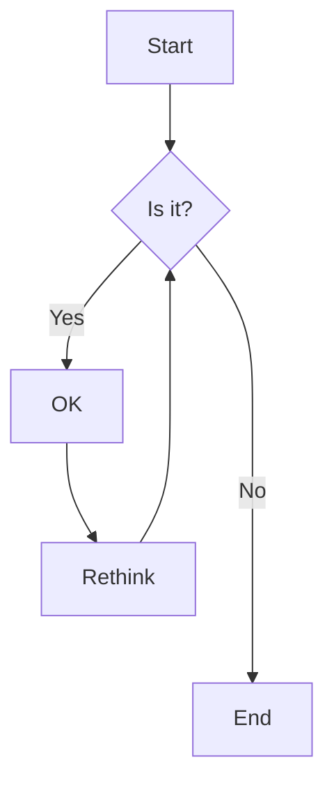
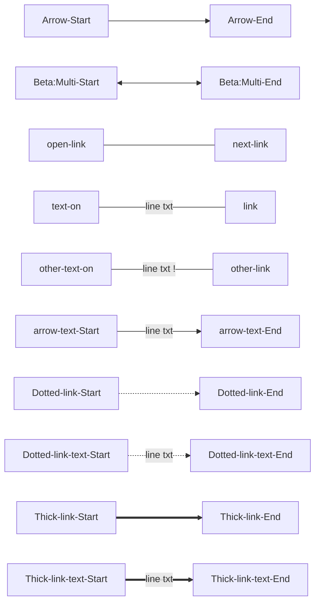

# map mermaid


## base

```
graph TD
    A[Start] --> B{Is it?};
    B -- Yes --> C[OK];
    C --> D[Rethink];
    D --> B;
    B -- No ----> E[End];
```



### lines

```
graph LR
   Arrow-Start-->Arrow-End;
   Beta:Multi-Start <--> Beta:Multi-End;
   open-link---next-link;
   text-on---|line txt|link;
   other-text-on-- line txt !--- other-link;
   arrow-text-Start-->|line txt|arrow-text-End;
   Dotted-link-Start-.->Dotted-link-End;
   Dotted-link-text-Start-.->|line txt|Dotted-link-text-End;
   Thick-link-Start==>Thick-link-End;
   Thick-link-text-Start== line txt ==>Thick-link-text-End;
```


